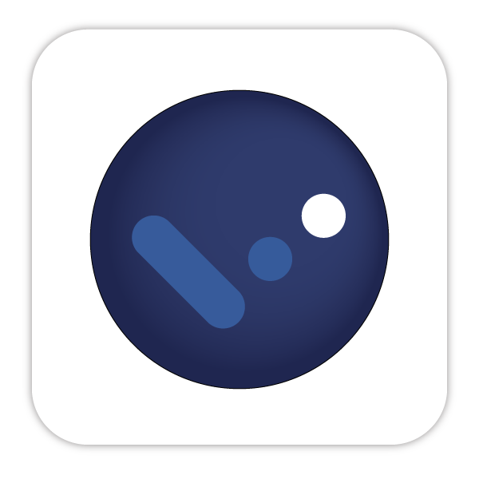

# Getting Started with React TodoList App

## overview:

Simple `TodoList App` using [`React`](https://github.com/facebook/create-react-app) ⚛️ with `theme feature:`

### `Themes used:`

 `Aqua`.
 `Black`.
 `Blue`.
 `Brown`.
 `Coral`.
 `Gray`.
 `Keppel`.
 `Moss`.
 `Peru`.
 `Pink`.
 `Purpel`.

Developed By `@whybe7` 👌.\
And Thanks to [Netlify](https://www.netlify.com/) for hosting My App [ToDoList](https://taskliste.netlify.app/).

